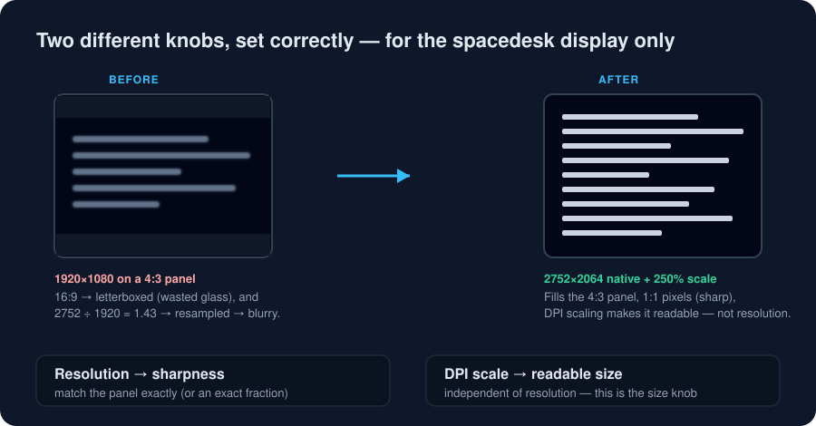

# spacedesk Auto-Snap

**Plug the iPad in as a second display, and Windows just gets it right — sharp *and* readable — with zero trips to Display Settings. Unplug it, and your real monitor was never touched.**

A tiny PowerShell tool that sits on top of the free [spacedesk](https://www.spacedesk.net/) app and fixes the one thing that makes an iPad-as-second-monitor annoying to live with: every time it connects, the picture comes up either razor-tiny or soft and blurry, and you're back in Settings dragging sliders.



---

## The problem

I use an iPad Pro 13" (M4) as an occasional second screen for a Windows 11 PC over spacedesk. It's a *temporary* device — it comes and goes — so having to reconfigure the PC's display settings every time it showed up felt exactly backwards. Worse, no setting seemed right: the desktop was either too small to read, or readable but visibly degraded and laggy.

## The symptom

Two complaints that felt like a trade-off but weren't:

- **Too small.** At the resolution spacedesk came up with, text on the iPad was about half the size of the main monitor.
- **Blurry and sluggish.** Trying to fix the size by lowering the resolution made everything soft.

You could get sharp-but-tiny, or readable-but-fuzzy — never both.

## Diagnosis (the measured root cause)

It turned out to be two independent faults, not one:

1. **Aspect-ratio + non-integer upscale = blur.** The iPad panel is exactly **2752 × 2064 (4:3)**. spacedesk was sending a 16:9 mode (1920×1080), so the image was *letterboxed* onto the 4:3 glass **and** scaled by a non-integer factor (2752 ÷ 1920 ≈ 1.43). The iPad then resamples every frame — soft text that no compression or quality setting can fix.
2. **Resolution ≠ readability.** Reaching for resolution to fix "everything is tiny" is the trap. Lowering resolution re-introduces the blur, because *size* and *sharpness* are two different knobs.

## The insight

> Resolution controls **sharpness**; DPI scaling controls **size**. They're independent. Set the resolution to the panel's native grid (or an exact fraction) so it's pixel-perfect, set the DPI scale so it's readable — and do both only on the spacedesk display.

That reframes the whole thing from a rendering problem into an **automation** problem: the numbers were never really the issue, *having to enter them by hand every time* was.

## The solution

`Set-SpacedeskDisplay.ps1` finds the virtual "spacedesk" display and, in one shot:

1. sets its **resolution** to native `2752×2064` (pixel-perfect, no resampling), and
2. applies a per-monitor **DPI scale** of `250%` using the same undocumented `DisplayConfig` API the Windows Scale slider uses.

It is **idempotent** (re-running does nothing if already correct) and it **refuses to touch the primary monitor**, so it's safe to fire on every connect. `Watch-Spacedesk.ps1` + `Register-AutoSnap.ps1` make it fully hands-off: a logon task watches for the display and snaps it automatically. You never open Settings.

The deeper technical write-up — how the undocumented per-monitor DPI call works, and why spacedesk gives no clean "connected" event — is in [`docs/how-it-works.md`](docs/how-it-works.md).

## Requirements

- Windows 10/11
- [spacedesk](https://www.spacedesk.net/) installed and working (this tool tunes it; it doesn't replace it)
- Run in your **own interactive PowerShell session** (the display APIs need a real desktop; a background service can't do this)
- No administrator rights needed

## Install & usage

```powershell
git clone https://github.com/davidlwilson2021/solution_2_my_problem.git
cd solution_2_my_problem
```

If script execution is blocked, allow local scripts for your user once:

```powershell
Set-ExecutionPolicy -Scope CurrentUser RemoteSigned
```

**Snap the display now** (connect the iPad first):

```powershell
# Defaults: 2752x2064 @ 250%
.\Set-SpacedeskDisplay.ps1

# Preview without applying
.\Set-SpacedeskDisplay.ps1 -WhatIf

# Use a preset from config.json (see below)
.\Set-SpacedeskDisplay.ps1 -Profile usb

# Or set it by hand
.\Set-SpacedeskDisplay.ps1 -Width 1376 -Height 1032 -Scale 125
```

**Not sure it's detected?** List every active display (read-only) and see which one matches. If the spacedesk display is listed under a different name, pass that name with `-Match`:

```powershell
.\Set-SpacedeskDisplay.ps1 -List
```

**Make it automatic** (install a hidden watcher that snaps the display on connect):

```powershell
.\Register-AutoSnap.ps1                 # event-driven watcher
.\Register-AutoSnap.ps1 -Mode Poll      # polling fallback if events are flaky
.\Register-AutoSnap.ps1 -Uninstall      # remove it
```

No admin required: it registers a hidden logon **scheduled task** if run elevated, and otherwise
falls back automatically to a per-user **HKCU `Run`** logon entry. Either way the watcher runs
un-elevated in your session and re-applies the snap idempotently on every connect.

### Presets (`config.json`)

Two profiles ship by default, both landing on the **same ~1101×826 logical desktop** so your windows keep their places when you switch connection type:

| Profile | Resolution | Scale | For |
|---------|-----------|-------|-----|
| `lan` | 2752×2064 | 250% | Wi-Fi / LAN — native, pixel-perfect, best quality |
| `usb` | 1376×1032 | 125% | USB — exact half (clean 2× upscale, still no blur), one-quarter the pixels to push |

Running with no `-Profile` applies the config's `defaultProfile` (ships as `lan`). Edit the numbers for your own tablet, or add a new profile and pass it with `-Profile <name>`.

> **Why USB gets the lean profile:** spacedesk's iOS-over-USB path tunnels through Apple's "Mobile Device Ethernet" adapter, which negotiates ~100 Mbps — about a tenth of a wired gigabit LAN. Fewer pixels there is a deliberate bandwidth choice, not a quality compromise; 1376×1032 is still pixel-perfect because it's exactly half of native on both axes, so the tablet upscales it by a clean integer 2×.

## What I learned

- The "sharp vs. readable" dilemma was a **false dichotomy** caused by fixing the wrong axis. Two orthogonal knobs (resolution = sharpness, DPI scale = size) dissolve it.
- Windows exposes **no documented** way to set a specific monitor's scale percentage — the Scale slider rides an undocumented `DisplayConfig` device-info type (`-4`), whose values are *relative to a per-display "recommended" step*. Getting that math right (and verifying the struct layouts against a known-good reference) was the real work.
- spacedesk is an **IddCx indirect display**, so "the monitor connected" isn't a clean single event — the adapter persists and only a child node arrives. The robust answer is *verify presence*, not *trust the event*.
- The best fix for a recurring annoyance is often **automation, not configuration**.

## Status & caveats

- The per-monitor DPI mechanism is undocumented (but stable, and used by the OS itself). Struct layouts are verified against [`lihas/windows-DPI-scaling-sample`](https://github.com/lihas/windows-DPI-scaling-sample).
- Defaults target an iPad Pro 13" (M4); change `config.json` for other panels.
- Because spacedesk gives no guaranteed per-connect event, the event watcher is best-effort with a polling fallback — both converge on the same idempotent snap.

## License

[MIT](LICENSE) © 2026 David Wilson
